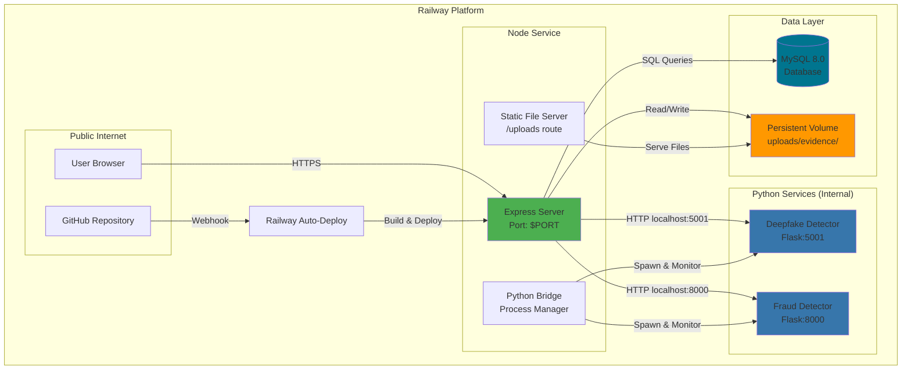
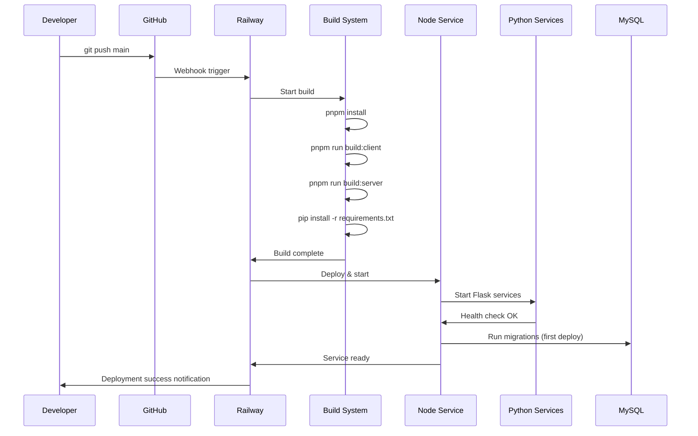

# Railway Deployment Configuration - Design Document

## Overview

This design document specifies the architecture and configuration for deploying the CyberShakti cybersecurity platform to Railway. The deployment supports a multi-service architecture with Node.js backend, Python AI/ML services (fraud detection and deepfake detection), MySQL database, and persistent file storage.

The design focuses on Railway's platform capabilities including automatic environment variable injection, nixpacks build system, volume management, and service orchestration. The configuration is designed to work without requiring code changes to the existing application.

### Key Design Goals

1. Zero-code-change deployment: Existing application code runs without modification
2. Service isolation: Each service (Node, Python, MySQL) runs independently with proper communication
3. Data persistence: Database and uploaded files persist across deployments
4. Automatic builds: GitHub integration triggers deployments on push
5. Health monitoring: Services self-monitor and auto-restart on failure
6. Developer experience: Clear documentation and troubleshooting guidance

## Architecture

### High-Level Architecture



### Service Communication Patterns

1. **External → Node Service**: HTTPS traffic from users hits the Node service on Railway's assigned PORT
2. **Node → Python Services**: HTTP requests to localhost:5001 (deepfake) and localhost:8000 (fraud)
3. **Node → MySQL**: TCP connection using Railway-injected environment variables
4. **Node → Volume**: File system operations to mounted volume at uploads/evidence/
5. **GitHub → Railway**: Webhook triggers automatic deployment on push to main branch

### Deployment Flow



## Components and Interfaces

### 1. Node Service Configuration

**Purpose**: Main application server hosting Express backend and React frontend

**Configuration Files**:
- `railway.json`: Service definition and build configuration
- `nixpacks.toml`: Custom build system configuration for Python dependencies
- `Procfile`: Process type definition (optional, Railway auto-detects)

**Environment Variables**:
```
# Railway-provided
PORT=<auto-assigned>
RAILWAY_ENVIRONMENT=production

# Database (auto-injected from MySQL service)
MYSQLHOST=<railway-mysql-host>
MYSQLPORT=3306
MYSQLUSER=root
MYSQLPASSWORD=<auto-generated>
MYSQLDATABASE=railway

# Application mapping (configured manually)
DB_HOST=${{MYSQLHOST}}
DB_PORT=${{MYSQLPORT}}
DB_USER=${{MYSQLUSER}}
DB_PASSWORD=${{MYSQLPASSWORD}}
DB_NAME=${{MYSQLDATABASE}}

# Python services (internal)
FLASK_PORT=5001
FRAUD_API_URL=http://localhost:8000

# API keys (configured manually)
VIRUSTOTAL_API_KEY=<user-provided>
URLVOID_API_KEY=<user-provided>
GOOGLE_SAFE_BROWSING_API_KEY=<user-provided>

# Node environment
NODE_ENV=production
```

**Build Commands**:
```bash
# Install Node dependencies
pnpm install

# Build frontend
pnpm run build:client

# Build backend
pnpm run build:server

# Install Python dependencies
pip install -r requirements.txt
```

**Start Command**:
```bash
node dist/server/node-build.mjs
```

**Health Check Endpoint**: `/api/ping` (returns 200 OK)

### 2. Python Services Configuration

**Purpose**: AI/ML services for fraud detection and deepfake detection

**Services**:
1. **Deepfake Detector** (api_server.py)
   - Port: 5001
   - Endpoints: `/api/deepfake/analyze`, `/api/deepfake/stats`
   - Started by: PythonBridge in Node service

2. **Fraud Detector** (fraud_detector.py)
   - Port: 8000
   - Endpoints: `/detect`, `/health`
   - Started by: PythonBridge in Node service

**Dependencies** (requirements.txt):
```
opencv-python
numpy
pillow
scikit-learn
flask
flask-cors
```

**System Dependencies** (nixpacks.toml):
```
libGL.so.1 (for opencv-python)
libglib-2.0.so.0 (for opencv-python)
```

**Process Management**:
- Python processes are spawned as child processes of the Node service
- PythonBridge monitors health and handles graceful shutdown
- Processes communicate via HTTP on localhost

### 3. MySQL Service Configuration

**Purpose**: Persistent relational database for scam reports and user data

**Configuration**:
- Version: MySQL 8.0+
- Provisioned by: Railway MySQL plugin
- Connection: Automatic environment variable injection
- Persistence: Data persists across deployments

**Schema Initialization**:
- Schema file: `database/schema.sql`
- Execution: On first deployment via Node service startup script
- Tables: `scam_reports`, `general_scam_reports`, `admin_users`, `scam_evidence_files`

**Connection String Format**:
```
mysql://${MYSQLUSER}:${MYSQLPASSWORD}@${MYSQLHOST}:${MYSQLPORT}/${MYSQLDATABASE}
```

### 4. Persistent Volume Configuration

**Purpose**: Store uploaded evidence files that persist across deployments

**Configuration**:
- Mount path: `/app/uploads/evidence`
- Minimum size: 1GB
- Access: Read/write from Node service
- Serving: Static file route `/uploads` in Express

**File Upload Flow**:
1. User uploads file via `/api/general-reports` endpoint
2. Multer middleware saves to `uploads/evidence/`
3. File metadata stored in MySQL (`scam_evidence_files` table)
4. Files served via `/uploads/:filename` route

## Data Models

### Environment Variable Mapping

Railway provides MySQL connection variables with specific names that need to be mapped to application variables:

| Railway Variable | Application Variable | Purpose |
|-----------------|---------------------|---------|
| `MYSQLHOST` | `DB_HOST` | Database hostname |
| `MYSQLPORT` | `DB_PORT` | Database port (3306) |
| `MYSQLUSER` | `DB_USER` | Database username |
| `MYSQLPASSWORD` | `DB_PASSWORD` | Database password |
| `MYSQLDATABASE` | `DB_NAME` | Database name |
| `PORT` | (used directly) | Node service port |

### Configuration File Structure

**railway.json**:
```json
{
  "$schema": "https://railway.app/railway.schema.json",
  "build": {
    "builder": "NIXPACKS",
    "buildCommand": "pnpm install && pnpm run build"
  },
  "deploy": {
    "startCommand": "node dist/server/node-build.mjs",
    "healthcheckPath": "/api/ping",
    "healthcheckTimeout": 300,
    "restartPolicyType": "ON_FAILURE",
    "restartPolicyMaxRetries": 10
  }
}
```

**nixpacks.toml**:
```toml
[phases.setup]
nixPkgs = ["nodejs_20", "python311", "python311Packages.pip"]

[phases.install]
cmds = [
  "pnpm install",
  "pip install -r requirements.txt"
]

[phases.build]
cmds = [
  "pnpm run build:client",
  "pnpm run build:server"
]

[start]
cmd = "node dist/server/node-build.mjs"
```

### Database Schema Summary

**scam_reports**: Location-based scam reports with geospatial indexing
- Primary key: `id` (INT AUTO_INCREMENT)
- Geolocation: `latitude`, `longitude`, `location_point` (POINT with SPATIAL INDEX)
- Status: ENUM('pending', 'verified', 'rejected')

**general_scam_reports**: Non-location scam reports with evidence
- Primary key: `id` (INT AUTO_INCREMENT)
- Evidence: `evidence_url`, `evidence_filename`
- Status: ENUM('pending', 'approved', 'rejected', 'under_review')
- Foreign key: `reviewed_by` → `admin_users(id)`

**scam_evidence_files**: File upload tracking
- Primary key: `id` (INT AUTO_INCREMENT)
- Foreign key: `report_id` → `general_scam_reports(id)` ON DELETE CASCADE
- Metadata: `filename`, `file_size`, `mime_type`, `file_path`

## Correctness Properties

*A property is a characteristic or behavior that should hold true across all valid executions of a system—essentially, a formal statement about what the system should do. Properties serve as the bridge between human-readable specifications and machine-verifiable correctness guarantees.*

### Property 1: Inter-Service HTTP Communication

*For any* valid HTTP request from Node service to Python services (ports 5001 or 8000), the request should complete successfully and return a valid HTTP response when the Python service is healthy.

**Validates: Requirements 1.2**

### Property 2: Database Connection with Railway Variables

*For any* valid SQL query executed by the Node service, the connection should succeed using the Railway-provided environment variables (MYSQLHOST, MYSQLPORT, MYSQLUSER, MYSQLPASSWORD, MYSQLDATABASE) mapped to application variables.

**Validates: Requirements 1.3, 2.3**

### Property 3: Python Process Management

*For any* Python service (deepfake or fraud detector), when started by PythonBridge, the process should respond to health checks within the configured timeout period.

**Validates: Requirements 1.4, 6.2**

### Property 4: Data Persistence Across Restarts

*For any* data inserted into the MySQL database, the data should remain accessible after service restarts or redeployments.

**Validates: Requirements 2.5**

### Property 5: File Persistence Across Deployments

*For any* file uploaded to the uploads/evidence/ directory, the file should remain accessible after application restarts and redeployments.

**Validates: Requirements 3.2, 3.3**

### Property 6: Static File Serving

*For any* file stored in the uploads/evidence/ directory, the file should be accessible via HTTP GET request to the /uploads route.

**Validates: Requirements 3.4**

### Property 7: Python Service Startup Without Import Errors

*For any* Python service with properly installed dependencies, the service should start without raising ImportError exceptions.

**Validates: Requirements 4.4**

### Property 8: Build Output Directory Structure

*For any* successful build execution, the build system should create dist/spa and dist/server directories containing the compiled frontend and backend files respectively.

**Validates: Requirements 5.4**

### Property 9: Health Check Synchronization

*For any* Node service startup, the service should not accept external requests until Python services respond successfully to health checks.

**Validates: Requirements 6.3**

### Property 10: Dynamic Port Binding

*For any* PORT environment variable value provided by Railway, the Node service should listen on that port.

**Validates: Requirements 6.5, 12.1**

### Property 11: Health Endpoint Availability

*For any* HTTP GET request to /api/ping when the Node service is running, the endpoint should return HTTP 200 OK status.

**Validates: Requirements 9.2**

### Property 12: Configuration File Deployment

*For any* valid railway.json, nixpacks.toml, and Procfile configuration, deploying to Railway with these files should result in a successful deployment without requiring file modifications.

**Validates: Requirements 11.5**

### Property 13: Localhost Communication for Python Services

*For any* Python service started by PythonBridge, the Node service should communicate with it using localhost URLs (http://localhost:5001 or http://localhost:8000).

**Validates: Requirements 12.3**

## Error Handling

### Build Failures

**Scenario**: Build fails due to missing dependencies or compilation errors

**Handling**:
1. Railway keeps previous deployment running (zero-downtime)
2. Build logs show detailed error messages
3. Developer receives notification via Railway dashboard/email
4. Troubleshooting steps in RAILWAY_DEPLOYMENT.md guide resolution

**Common Causes**:
- Missing or incorrect package.json scripts
- Python dependency conflicts
- System library missing for opencv-python
- Out of memory during build

### Python Service Startup Failures

**Scenario**: Python services fail to start or health checks timeout

**Handling**:
1. PythonBridge logs detailed error messages with troubleshooting steps
2. Node service continues running but returns 503 for Python-dependent endpoints
3. Health check retries with exponential backoff (max 20 attempts)
4. Graceful degradation: Core features work, AI features unavailable

**Common Causes**:
- Missing Python dependencies
- Port already in use (unlikely in Railway)
- Python script syntax errors
- Import errors from missing system libraries

### Database Connection Failures

**Scenario**: Node service cannot connect to MySQL

**Handling**:
1. Connection retry logic with exponential backoff
2. Detailed error logging with connection string (password redacted)
3. Service health check fails, triggering Railway restart
4. Environment variable validation on startup

**Common Causes**:
- MySQL service not provisioned
- Environment variables not configured
- Network connectivity issues
- Invalid credentials

### Volume Mount Failures

**Scenario**: Persistent volume not mounted or inaccessible

**Handling**:
1. File upload endpoints return 500 with descriptive error
2. Startup validation checks volume directory exists and is writable
3. Logs show permission errors or mount issues
4. Fallback: Warn user, continue without file uploads

**Common Causes**:
- Volume not provisioned in Railway
- Incorrect mount path configuration
- Permission issues
- Volume full (exceeds capacity)

### Health Check Failures

**Scenario**: Health checks fail repeatedly

**Handling**:
1. Railway restarts the service automatically (up to 10 retries)
2. Logs capture health check failures with timestamps
3. Alert sent to developer after 5 minutes of failures
4. Exponential backoff between restart attempts

**Common Causes**:
- Service crashed or hung
- Database connection lost
- Python services not responding
- Memory exhaustion

## Testing Strategy

### Unit Testing

Unit tests focus on specific examples, edge cases, and error conditions:

1. **Configuration Validation**
   - Test environment variable parsing with valid/invalid values
   - Test default value fallbacks
   - Test configuration file JSON/TOML parsing

2. **Database Connection**
   - Test connection with valid credentials
   - Test connection failure handling
   - Test query execution with sample data

3. **File Upload**
   - Test file save to uploads/evidence/
   - Test file retrieval via /uploads route
   - Test file size limits and validation

4. **Python Bridge**
   - Test process spawning with valid Python script
   - Test health check with mock Flask server
   - Test graceful shutdown

5. **Error Scenarios**
   - Test missing environment variables
   - Test Python import errors
   - Test database connection failures
   - Test volume mount failures

### Property-Based Testing

Property tests verify universal properties across all inputs (minimum 100 iterations per test):

**Test Configuration**: Use fast-check (JavaScript) for Node service tests

1. **Property Test: Inter-Service Communication**
   ```javascript
   // Feature: railway-deployment-config, Property 1: Inter-Service HTTP Communication
   fc.assert(
     fc.asyncProperty(
       fc.record({
         endpoint: fc.constantFrom('/api/deepfake/stats', '/health'),
         port: fc.constantFrom(5001, 8000)
       }),
       async ({ endpoint, port }) => {
         const response = await fetch(`http://localhost:${port}${endpoint}`);
         expect(response.ok).toBe(true);
       }
     ),
     { numRuns: 100 }
   );
   ```

2. **Property Test: Database Persistence**
   ```javascript
   // Feature: railway-deployment-config, Property 4: Data Persistence Across Restarts
   fc.assert(
     fc.asyncProperty(
       fc.record({
         title: fc.string({ minLength: 1, maxLength: 255 }),
         description: fc.string({ minLength: 1 }),
         scam_type: fc.constantFrom('phishing', 'phone_scam', 'fake_website')
       }),
       async (report) => {
         const insertId = await db.insertReport(report);
         await restartService();
         const retrieved = await db.getReport(insertId);
         expect(retrieved).toMatchObject(report);
       }
     ),
     { numRuns: 100 }
   );
   ```

3. **Property Test: File Persistence**
   ```javascript
   // Feature: railway-deployment-config, Property 5: File Persistence Across Deployments
   fc.assert(
     fc.asyncProperty(
       fc.record({
         filename: fc.string({ minLength: 1, maxLength: 100 }),
         content: fc.uint8Array({ minLength: 1, maxLength: 1024 })
       }),
       async ({ filename, content }) => {
         const filepath = path.join('uploads/evidence', filename);
         await fs.writeFile(filepath, content);
         await simulateRedeployment();
         const retrieved = await fs.readFile(filepath);
         expect(retrieved).toEqual(content);
       }
     ),
     { numRuns: 100 }
   );
   ```

4. **Property Test: Port Binding**
   ```javascript
   // Feature: railway-deployment-config, Property 10: Dynamic Port Binding
   fc.assert(
     fc.asyncProperty(
       fc.integer({ min: 3000, max: 9000 }),
       async (port) => {
         process.env.PORT = port.toString();
         const server = await startServer();
         const address = server.address();
         expect(address.port).toBe(port);
         await server.close();
       }
     ),
     { numRuns: 100 }
   );
   ```

5. **Property Test: Health Endpoint**
   ```javascript
   // Feature: railway-deployment-config, Property 11: Health Endpoint Availability
   fc.assert(
     fc.asyncProperty(
       fc.constant(null), // No input needed
       async () => {
         const response = await fetch('http://localhost:${PORT}/api/ping');
         expect(response.status).toBe(200);
         const data = await response.json();
         expect(data).toHaveProperty('status', 'ok');
       }
     ),
     { numRuns: 100 }
   );
   ```

### Integration Testing

Integration tests verify service interactions:

1. **Node → Python Communication**
   - Start both services
   - Make request from Node to Python
   - Verify response format and data

2. **Node → MySQL Communication**
   - Connect to database
   - Execute CRUD operations
   - Verify data integrity

3. **File Upload → Storage → Retrieval**
   - Upload file via API
   - Verify file exists in volume
   - Retrieve file via /uploads route
   - Verify content matches

4. **End-to-End Deployment**
   - Deploy to Railway staging environment
   - Run smoke tests on all endpoints
   - Verify environment variables
   - Check logs for errors

### Deployment Verification

Post-deployment checks to verify successful deployment:

1. **Service Health**
   - Check /api/ping returns 200
   - Check Python services respond to health checks
   - Verify all services show "running" in Railway dashboard

2. **Database Connectivity**
   - Execute test query
   - Verify schema exists
   - Check sample data

3. **File Storage**
   - Upload test file
   - Verify file persists
   - Retrieve file via URL

4. **Environment Variables**
   - Log (redacted) configuration on startup
   - Verify all required variables present
   - Check variable mapping correct

5. **Build Artifacts**
   - Verify dist/spa contains frontend files
   - Verify dist/server contains backend files
   - Check Python packages installed

## Database Migration Strategy

### Initial Deployment

**Objective**: Create database schema on first deployment

**Approach**:
1. Check if tables exist using `SHOW TABLES` query
2. If tables don't exist, execute `database/schema.sql`
3. Log migration status (success/failure)
4. Continue startup regardless (graceful degradation)

**Implementation** (in server/index.ts):
```typescript
async function runMigrations() {
  try {
    const [tables] = await db.query('SHOW TABLES');
    if (tables.length === 0) {
      console.log('[Migration] Running initial schema migration...');
      const schema = await fs.readFile('database/schema.sql', 'utf-8');
      await db.query(schema);
      console.log('[Migration] ✓ Schema migration complete');
    } else {
      console.log('[Migration] Schema already exists, skipping migration');
    }
  } catch (error) {
    console.error('[Migration] ❌ Migration failed:', error);
    console.error('[Migration] Service will continue, but database may not be initialized');
  }
}
```

### Subsequent Deployments

**Objective**: Apply schema changes without data loss

**Approach**:
1. Use ALTER TABLE statements for schema changes
2. Create migration files: `database/migrations/001_add_column.sql`
3. Track applied migrations in `schema_migrations` table
4. Apply pending migrations on startup

**Migration Tracking Table**:
```sql
CREATE TABLE IF NOT EXISTS schema_migrations (
  id INT AUTO_INCREMENT PRIMARY KEY,
  version VARCHAR(255) UNIQUE NOT NULL,
  applied_at TIMESTAMP DEFAULT CURRENT_TIMESTAMP
);
```

**Migration Runner**:
```typescript
async function runPendingMigrations() {
  const migrationFiles = await fs.readdir('database/migrations');
  for (const file of migrationFiles.sort()) {
    const version = file.replace('.sql', '');
    const [existing] = await db.query(
      'SELECT * FROM schema_migrations WHERE version = ?',
      [version]
    );
    if (existing.length === 0) {
      const sql = await fs.readFile(`database/migrations/${file}`, 'utf-8');
      await db.query(sql);
      await db.query(
        'INSERT INTO schema_migrations (version) VALUES (?)',
        [version]
      );
      console.log(`[Migration] ✓ Applied migration: ${version}`);
    }
  }
}
```

### Rollback Strategy

**Approach**: Manual rollback via Railway CLI or dashboard

**Steps**:
1. Identify problematic deployment in Railway dashboard
2. Click "Rollback" to previous deployment
3. If database changes need reversal, execute rollback SQL manually
4. Create rollback scripts for each migration: `001_add_column_rollback.sql`

**Best Practices**:
- Always test migrations in staging environment first
- Keep migrations small and focused
- Write rollback scripts alongside migrations
- Backup database before major schema changes
- Use transactions where possible

## File Storage Architecture

### Volume Configuration

**Mount Point**: `/app/uploads/evidence`
**Size**: 1GB minimum (configurable in Railway dashboard)
**Persistence**: Data persists across deployments and restarts

### Directory Structure

```
/app/
├── uploads/
│   └── evidence/
│       ├── 1234567890_evidence.jpg
│       ├── 1234567891_screenshot.png
│       └── 1234567892_document.pdf
```

### File Upload Flow

1. **Client Request**: POST to `/api/general-reports` with multipart/form-data
2. **Multer Middleware**: Validates file type, size, and saves to uploads/evidence/
3. **Filename Generation**: `${timestamp}_${sanitized_original_name}`
4. **Database Record**: Insert file metadata into `scam_evidence_files` table
5. **Response**: Return file URL: `/uploads/${filename}`

### File Serving

**Route**: `/uploads/:filename`
**Implementation**: Express static middleware
```typescript
app.use('/uploads', express.static('uploads'));
```

**Security**:
- Validate filename to prevent directory traversal
- Check file exists before serving
- Set appropriate Content-Type headers
- Rate limit file downloads

### File Cleanup

**Strategy**: Periodic cleanup of orphaned files

**Orphaned Files**: Files in volume but not in database
**Cleanup Job**: Cron job or manual script
```typescript
async function cleanupOrphanedFiles() {
  const filesOnDisk = await fs.readdir('uploads/evidence');
  const filesInDb = await db.query('SELECT filename FROM scam_evidence_files');
  const dbFilenames = new Set(filesInDb.map(f => f.filename));
  
  for (const file of filesOnDisk) {
    if (!dbFilenames.has(file)) {
      await fs.unlink(`uploads/evidence/${file}`);
      console.log(`[Cleanup] Removed orphaned file: ${file}`);
    }
  }
}
```

### Backup Strategy

**Approach**: Railway volume snapshots + external backup

**Railway Snapshots**:
- Automatic snapshots (if enabled in Railway)
- Manual snapshots before major deployments
- Restore from snapshot via Railway dashboard

**External Backup**:
- Periodic sync to S3 or similar object storage
- Backup script runs via cron or Railway scheduled job
- Retention policy: Keep last 30 days

## Service Communication Patterns

### Node → Python (HTTP)

**Pattern**: HTTP requests to localhost

**Deepfake Detection**:
```typescript
const response = await fetch('http://localhost:5001/api/deepfake/analyze', {
  method: 'POST',
  body: formData
});
```

**Fraud Detection**:
```typescript
const response = await fetch('http://localhost:8000/detect', {
  method: 'POST',
  headers: { 'Content-Type': 'application/json' },
  body: JSON.stringify({ message })
});
```

**Error Handling**:
- Timeout: 30 seconds
- Retry: 3 attempts with exponential backoff
- Fallback: Return 503 if Python service unavailable

### Node → MySQL (TCP)

**Pattern**: Connection pool with mysql2

**Connection**:
```typescript
const pool = mysql.createPool({
  host: process.env.DB_HOST,
  port: parseInt(process.env.DB_PORT || '3306'),
  user: process.env.DB_USER,
  password: process.env.DB_PASSWORD,
  database: process.env.DB_NAME,
  connectionLimit: 10,
  queueLimit: 0
});
```

**Query Execution**:
```typescript
const [rows] = await pool.query('SELECT * FROM scam_reports WHERE id = ?', [id]);
```

**Error Handling**:
- Connection errors: Retry with exponential backoff
- Query errors: Log and return 500
- Transaction rollback on error

### PythonBridge → Python Processes

**Pattern**: Child process management

**Process Spawning**:
```typescript
const proc = spawn('python3', ['python/api_server.py', '--port', '5001'], {
  cwd: process.cwd(),
  env: process.env,
  stdio: ['ignore', 'pipe', 'pipe']
});
```

**Health Monitoring**:
```typescript
async function checkHealth() {
  const response = await fetch('http://localhost:5001/api/deepfake/stats');
  return response.ok;
}
```

**Graceful Shutdown**:
```typescript
process.on('SIGTERM', async () => {
  console.log('[Shutdown] Stopping Python services...');
  pythonBridge.stop();
  await new Promise(resolve => setTimeout(resolve, 5000));
  process.exit(0);
});
```

### External → Node (HTTPS)

**Pattern**: Railway provides HTTPS termination

**Public URL**: `https://<project-name>.up.railway.app`
**SSL**: Automatic SSL certificate from Railway
**Routing**: All traffic routes to Node service on PORT

**Request Flow**:
1. User makes HTTPS request to Railway URL
2. Railway terminates SSL
3. Railway forwards HTTP request to Node service on PORT
4. Node service processes request
5. Response flows back through Railway to user

